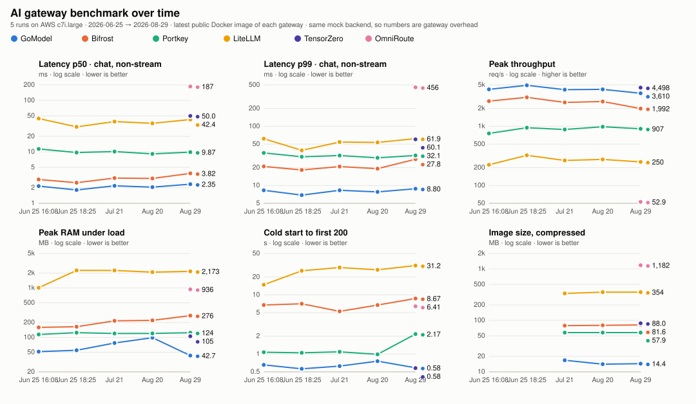

# Run history

Newest first. Latency is chat/completions non-streaming, median across trials. Peak req/s comes from the capacity sweep, RAM from `docker stats` under sustained load. Raw data for each run is in the directory named after it; `history.json` holds the same numbers in machine-readable form.

## 2026-07-21 — 20260721-121034

`20260721-121034` · 2026-07-21 · AWS **c7i.large** (2 vCPU) · N=20,000 per variant · c=10 · 5 trial(s) · LiteLLM workers=2

| Gateway | Image | p50 (ms) | p99 (ms) | Peak req/s | Peak RAM (MB) | Cold start (s) | Image (MB) | Variants |
|---|---|--:|--:|--:|--:|--:|--:|:-:|
| GoModel | `gomodel-bench:local` | 2.19 | 8.30 | 4,154 | 39.7 | 0.62 | 16.8 | 6/6 |
| Bifrost | `maximhq/bifrost:latest` | 3.09 | 20.85 | 2,534 | 194.6 | 5.25 | 79.0 | 5/6 |
| Portkey | `portkeyai/gateway:latest` | 10.13 | 32.02 | 883 | 110.9 | 1.09 | 57.9 | 4/6 |
| LiteLLM | `ghcr.io/berriai/litellm:main-stable` | 38.78 | 54.18 | 265 | 2,264 | 28.93 | 334.2 | 6/6 |

Full tables: [`20260721-121034/summary.md`](20260721-121034/summary.md)

## 2026-06-25 — 20260625-182538

`20260625-182538` · 2026-06-25 · AWS **c7i.large** (2 vCPU) · N=8,000 per variant · c=10 · 2 trial(s) · LiteLLM workers=2

| Gateway | Image | p50 (ms) | p99 (ms) | Peak req/s | Peak RAM (MB) | Cold start (s) | Image (MB) | Variants |
|---|---|--:|--:|--:|--:|--:|--:|:-:|
| GoModel | `gomodel-bench:local` | 1.81 | 6.88 | 4,928 | 37.0 | 0.56 | — | 6/6 |
| Bifrost | `maximhq/bifrost:latest` | 2.51 | 18.27 | 3,088 | 143.0 | 7.07 | — | 5/6 |
| Portkey | `portkeyai/gateway:latest` | 9.70 | 30.54 | 946 | 112.0 | 1.05 | — | 4/6 |
| LiteLLM | `ghcr.io/berriai/litellm:main-stable` | 30.56 | 39.26 | 324 | 2,272 | 25.49 | — | 6/6 |

Full tables: [`20260625-182538/summary.md`](20260625-182538/summary.md)

## 2026-06-25 — 20260625-160856

`20260625-160856` · 2026-06-25 · AWS **c7i.large** (2 vCPU) · N=8,000 per variant · c=10 · 2 trial(s) · LiteLLM workers=1

| Gateway | Image | p50 (ms) | p99 (ms) | Peak req/s | Peak RAM (MB) | Cold start (s) | Image (MB) | Variants |
|---|---|--:|--:|--:|--:|--:|--:|:-:|
| GoModel | `gomodel-bench:local` | 2.16 | 8.29 | 4,202 | 34.1 | 0.66 | — | 6/6 |
| Bifrost | `maximhq/bifrost:latest` | 2.91 | 21.01 | 2,664 | 135.1 | 6.74 | — | 5/6 |
| Portkey | `portkeyai/gateway:latest` | 11.39 | 35.47 | 758 | 114.2 | 1.07 | — | 4/6 |
| LiteLLM | `ghcr.io/berriai/litellm:main-stable` | 44.45 | 61.71 | 223 | 1,009 | 14.82 | — | 6/6 |

Full tables: [`20260625-160856/summary.md`](20260625-160856/summary.md)

## 2026-06-20 — 20260620-202320

`20260620-202320` · 2026-06-20 · AWS **t2.micro** (1 vCPU) · N=300 per variant · c=10 · 1 trial(s) · LiteLLM workers=1

| Gateway | Image | p50 (ms) | p99 (ms) | Peak req/s | Peak RAM (MB) | Cold start (s) | Image (MB) | Variants |
|---|---|--:|--:|--:|--:|--:|--:|:-:|
| GoModel | `gomodel-bench:local` | 9.20 | 19.10 | — | 32.4 | — | — | 6/6 |
| Bifrost | `maximhq/bifrost:latest` | 1.12 | 223.05 | — | 266.6 | — | — | 6/6 |
| Portkey | `portkeyai/gateway:latest` | 38.71 | 72.77 | — | 64.9 | — | — | 4/6 |
| LiteLLM | `ghcr.io/berriai/litellm:main-stable` | 71.96 | 96.96 | — | 467.8 | — | — | 6/6 |

Full tables: [`20260620-202320/summary.md`](20260620-202320/summary.md)
